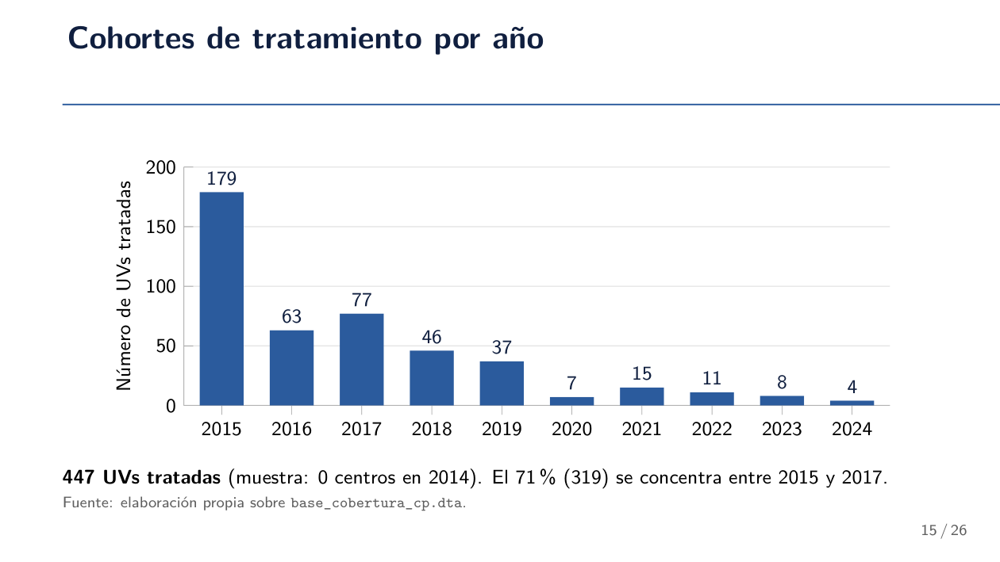

# Resumen para reunión — 2026-09-24

Preparado a partir de la extracción semanal del RIS: `merge_muestra_final.do`, `muestra_laboral_descript.do`, `primera_etapa.do`, `limpieza_hijos_2014_2024.do`, `rsh_uv_panel_2014_2024.do`, y sus salidas (`muestra_m_lab_desc_2.txt`, `primera_etapa.txt`, gráficos png).

---

## 0. Grupos de UV — definiciones

| Grupo (`grupo_t1`) | Definición | N (UVs) | % |
|---|---|---|---|
| Excluida | Ya tenía 1+ jardín en 2014 (no aplica al diseño) | 2,265 | 33.0% |
| Nunca tratada | 0 jardines en 2014, sigue en 0 toda la ventana 2015-2024 | 4,145 | 60.5% |
| Tratada | 0 jardines en 2014, abre su primer jardín en algún año 2015-2024 | 447 | 6.5% |
| **Universo total** | | **6,857** | 100% |
| Muestra del diseño (`muestra_t1==1`) | Nunca tratada + Tratada (se excluye Excluida) | 4,592 | — |

**Cohortes de apertura (`g1`), dentro de las 447 tratadas:**

| Año apertura | N UVs | | Año apertura | N UVs |
|---|---|---|---|---|
| 2015 | 179 | | 2020 | 7 |
| 2016 | 63 | | 2021 | 15 |
| 2017 | 77 | | 2022 | 11 |
| 2018 | 46 | | 2023 | 8 |
| 2019 | 37 | | 2024 | 4 |

**Punto para la reunión — por qué incluir 2014 como año base importa:** al fijar 2014 como el año de referencia ("0 centros en 2014" para entrar a la muestra), se captura completa la cohorte 2015 (179 UVs, el 40% de todas las tratadas) — la más grande de todas, ligada a la política pública de expansión de jardines de la administración Bachelet. Sin 2014 como base, esa cohorte no se puede identificar como "pasó de 0 a 1" (no hay año anterior para comparar), y las UVs tratadas quedarían en ~268 (447 − 179) en vez de 447 — consistente con el salto de ~260 a 400+ que recordabas. Vale la pena mostrar el gráfico de arriba y contar esta historia — conecta una decisión metodológica con un hecho de política pública real, que es un argumento sólido para la reunión.

---

## 1. Pregunta 1: ¿Cómo se construyó la muestra de mercado laboral?

### 1.1 Pipeline de construcción

1. **Base madre** (`rsh_uv_panel_2014_2024.do`): mujeres 18-70 años del RSH/FPS, 2014-2024. FPS para 2014-2015, RSH para 2016-2024. Se agregan variables a nivel UV (`pob_total_uv`, `n_hogares_uv`, `n_ninos_0_5_uv`, `densidad_ninos_uv`, `cse_prom_uv`). Panel no balanceado.

   **Decisiones clave dentro de este do-file:**
   - *Dos fuentes por cambio de instrumento*: FPS (hasta 2015) → RSH (desde 2016). Se homologan nombres de variable para poder apilarlas. No es elección metodológica, es obligado por disponibilidad de datos.
   - *Corte de diciembre*: cada año del panel es la foto de diciembre de ese año (L10), no un promedio ni panel intra-anual.
   - *En FPS (2014-2015) la UV no es confiable* → por eso 2014-2015 no tienen `pob_total_uv`/`densidad_ninos_uv`/etc., y por eso más adelante hay que anclar esos años a la UV de 2016 (ver más abajo). 
   - *`duplicates drop rut_inn, force`* (L80, 146, 177, 245): se descartan duplicados sin criterio de selección (se queda con el primero). FPS puede tener varios errores, en RSH casi nunca hay. 
   - *El merge con la cartografía de UV descarta a quien no matchea* (`keep if _merge==3` tras el merge con `UV_RSH/...`, L182/L190): restricción de muestra real, no solo de variable. 
   - *Orden correcto de operaciones*: las variables de contexto de UV (`pob_total_uv`, `n_ninos_0_5_uv`, etc.) se calculan ANTES de filtrar a mujeres 18-70 (L200-219 vs. L222-223) → los totales de UV reflejan la UV real (todas las edades/sexos), no un artefacto de la muestra filtrada.
   - *`cambia_uv`* (L307-310): bandera por mujer, fija para todo el panel, de si cambió de UV alguna vez. 

2. **Merge con hijos** (`limpieza_hijos_2014_2024.do`): genera `tuvo_hijo` (flujo, nacimientos) y `n_hijos_menor5` (stock de hijos vivos <5 años), a partir de la base histórica de hijos + ventana de exposición (nacimiento a nacimiento+4, cortada si el hijo falleció antes).
3. **Merge con tratamiento/cobertura** (`merge_muestra_final.do`): se pega la UV contemporánea (`id_uv_2024`) y las variables de tratamiento (`g1`, `grupo_t1`, `muestra_t1`, `post_t1`, `rel_t1`) desde `base_cobertura_cp.dta`.

   **Decisiones clave dentro de este do-file:**
   - *Universo acotado a RSH/FPS desde el inicio*: el merge con `hijos_panel.dta` (L15) trata `_merge==1` (sin hijo registrado) como `tuvo_hijo=0`, pero `_merge==2` (madre en la base de hijos pero NO en tu panel RSH/FPS) se **descarta** (L20). El propio comentario dice que esa parte "debe estar sesgada a altos ingresos" → tu universo excluye de partida a madres que nunca se registraron en RSH/FPS. Es un punto de validez externa real: los resultados aplican a la población que interactúa con protección social, no a todas las madres de Chile.
   - *El drop de mujeres >49 sin hijo<5 (L31) no es el filtro final de muestra* — es solo un recorte de eficiencia que bota filas inútiles para ambas sub-muestras. La restricción real de la muestra laboral viene en el split (punto 4).
   - *Para el análisis de tratamiento hay que matchear con la cartografía de cobertura*: `drop if missing(id_uv_2024) & !inlist(anio,2014,2015)` (L43) — desde 2016 en adelante, si no matchean con `cobertura_crosswalk_final.dta`, quedan fuera. Se deja excepción para 2014-2015 porque a esos años se les asigna UV en el paso siguiente.
   - **Ancla 2014-2015** (L50-78): como en FPS no existe una variable de "unidad vecinal" confiable, esos dos años usan la UV que la mujer tenía en **2016** como proxy (merge `keep(master match)`, L69). **Consecuencia poco obvia**: solo las mujeres que SÍ aparecen en 2016 heredan una UV — las que estaban en 2014/2015 pero salieron del panel antes de 2016 quedan con `codigo_uv_rsh` missing y se eliminan en L95 (el comentario lo confirma: "son las personas que no estaban en 2016, los eliminamos"). Es decir, **las observaciones de 2014-2015 están condicionadas a sobrevivir en el panel hasta 2016** — relevante porque son justo los años de pre-tendencia más tempranos.
   - El segundo merge de cobertura (L87, con `base_cobertura_cp.dta`) trae las variables "oficiales" de diseño del tratamiento (`g1`, `grupo_t1`, `muestra_t1`, `post_t1`, `rel_t1`, `stock_base`), separadas del merge más básico de cartografía del punto anterior.
4. **Split en 3 muestras** (después de que `id_uv_2024` y el tratamiento ya están finalizados):
   - `muestra_laboral_ingresos.dta`: mujer-años con `tiene_hijo_menor5==1` **ese año específico** (no basta con haber tenido un hijo alguna vez), + rentas (`rentas_rut_panelfinal`) + cotizaciones (`panel_cotizaciones_run_anio`).
   - `muestra_fertilidad.dta`: mujeres ≤49 años.
   - `muestra_completa_ruts_trat.dta`: solo rut/año/tratamiento — se usa después para pegar el tratamiento a los hijos en `primera_etapa.do`.

   En resumen, la muestra queda acotada por **tres capas de restricción distintas**: (a) población RSH/FPS, (b) match con cartografía de cobertura, (c) para 2014-2015, sobrevivir en el panel hasta 2016. 

### 1.1a Nota: variable `cambia_uv` (si se decide usar)

Limitaciones a tener claras antes de usarla como control o filtro:
- Missing para 2014-2015 (se calculó solo sobre el panel RSH 2016-2024, antes de pegar FPS).
- Es una bandera fija para todo el panel ("¿alguna vez cambió?"), no varía año a año.
- Se construye con `uv_rsh` (código contemporáneo/re-cartografiable), no con `id_uv_2024` (el ancla estable de `g1`/`rel_t1`) → puede confundir "se mudó" con "le recartografiaron la UV". No asumir que mide mudanza física pura.

### 1.2 Tamaño y estructura del panel

- N = 8,517,281 obs mujer-año · 1,909,347 mujeres únicas · 6,857 UVs únicas.
- Panel promedio: **5.5-5.7 años observados por mujer**, similar entre grupos (Excluida 5.63, Nunca tratada 5.47, Tratada 5.50) → no hay attrition diferencial visible por grupo de tratamiento.
- Composición por año y grupo (`tab anio grupo_t1`): Excluida ~5M obs, Nunca tratada ~2.9M, Tratada ~0.58M en total.
- `rel_t1` (tiempo relativo a apertura, solo UVs tratadas): rango -10 a +9, colas delgadas en los extremos (n=290 en k=-10, crece hasta n≈56,000 cerca de k=0), consistente con necesidad de agrupar la cola izquierda.

### 1.3 Construcción del outcome de ingreso

- `ingreso_anual` = renta imponible AFC; si falta, se usa cotizaciones (dependiente + independiente).
- `meses_trabajando` = meses con renta; si falta, meses cotizados.
- Missing en `ingreso_anual`: ~47% de las obs — alto, pero **la proporción con ingreso es prácticamente igual entre tratadas y nunca-tratadas cada año** (0.51-0.59 ambas), por lo que no parece ser missingness diferencial por tratamiento.

**Pregunta abierta para llevar a la reunión: ¿usar `per_fic_ingresoanual` como tercera fuente para completar missings?**
- Diagnóstico ya corrido en el do-file (L100-107): de las 1,219,289 mujeres con `ingreso_anual` missing, **833,078 (~70%) sí tienen dato en `per_fic_ingresoanual`** (ingreso autoreportado en la ficha RSH). Agregarlo como tercera fuente de fallback rescataría información para una fracción importante de la muestra.
- A favor: reduce fuertemente el missing, aumenta poder estadístico y representatividad de la muestra laboral.
- En contra / a discutir con los profes: `renta_imponible_anual` y las cotizaciones son fuentes **administrativas** (SII/AFP); `per_fic_ingresoanual` es **autoreportado** en una encuesta social. El RSH es la puerta de entrada a beneficios sociales focalizados, y existe un incentivo conocido a **subreportar** ingreso en ese contexto — un sesgo de naturaleza distinta al de las fuentes administrativas. Mezclar ambas podría introducir sesgo sistemático hacia abajo, especialmente relevante si ese sesgo no es igual entre tratadas y no tratadas.
- Pregunta concreta para plantear: ¿conviene una muestra más chica pero con una sola fuente de medición consistente (administrativa), o una muestra más grande pero con una variable que mezcla dos formas de medir ingreso con sesgos potencialmente distintos?

### 1.4 Balance pre-tratamiento a nivel UV (2014, nunca vs. tratada)

| | | Sin ponderar | | | Ponderado por población UV | | |
|---|---|---|---|---|---|---|---|
| **Variable** | **No tratada** | **Tratada** | **Dif. norm.** | **No tratada** | **Tratada** | **Dif. norm.** | **Sig.ᵃ** |
| Ingreso anual (millones CLP) | 3.60 | 3.55 | −0.033 | 3.95 | 3.89 | −0.039 | * |
| Meses trabajando | 8.14 | 8.10 | −0.024 | 8.44 | 8.37 | −0.058 | * |
| Edad | 29.24 | 29.25 | 0.008 | 29.26 | 29.29 | 0.026 | |
| N° hijos <5 | 1.11 | 1.11 | 0.045 | 1.11 | 1.11 | 0.049 | |
| Horas de trabajo | 37.07 | 37.68 | 0.099 | 36.55 | 36.81 | 0.068 | |
| Trabaja (proporción) | 0.45 | 0.45 | 0.023 | 0.48 | 0.48 | −0.006 | |
| Tipo de educación (código) | 4.98 | 5.02 | 0.028 | 5.20 | 5.18 | −0.020 | |
| **Población de la UV** | 1,126.79 | 2,011.08 | **0.410** | 3,530.92 | 5,287.26 | **0.340** | *** |
| Densidad niños 0-5 UV | 0.06 | 0.06 | 0.155 | 0.06 | 0.06 | 0.139 | *** |
| N (UVs) | 3,909 | 422 | | 3,909 | 422 | | |

*ᵃ Sig. = t-test a nivel mujer, mismo año (* p<0.05, *** p<0.01), solo como referencia — con N mucho mayor tiende a marcar significativas diferencias normalizadas pequeñas (ej. meses trabajando: * pero dif. norm. = −0.189). Se prioriza la diferencia normalizada, no las estrellas, por eso.*

**Conclusión:** las mujeres se parecen entre grupos (todas las diferencias normalizadas de variables individuales < 0.10, muy por debajo del umbral de preocupación de 0.25, en ambas versiones). Solo **población de la UV** (0.41 / 0.34) y, más moderadamente, **densidad de niños** (0.16 / 0.14) superan ese umbral — selección en el tamaño/composición de la UV, no en las mujeres. El diseño con FE por UV + año está pensado exactamente para esto. Tabla también disponible en PDF con formato de paper: `tabla_balance_uv_2014.pdf`.

---

## 2. Pregunta 2: ¿Aumenta la matrícula de niños en UVs tratadas?

### 2.1 Construcción del panel

- Base: hijos de las madres de la muestra (`hijos_filtrado_2014_2024.dta`), expandidos a panel niño-año (nacimiento a nacimiento+4, o hasta año de defunción si aplica).
- Se pega el tratamiento heredado de la madre (`muestra_completa_ruts_trat.dta`, merge por rut+año) — solo se queda con los hijos de madres que están en la muestra de tratamiento.
- Se pega matrícula parvularia (`mat_parv_2014_2025.dta`) por rut del niño + año → `matriculado = 1` si hay registro de matrícula ese año, `0` si no (correcto: un "no encontrado" se trata como no matriculado, no como missing).
- Colapso a nivel **UV-año** (`id_uv_2024 x anio`): `tasa_matricula` = promedio de matriculado, `n_ninos` = cantidad de niños en la celda.
- Restricción a `muestra_t1==1` (se descartan las UV "Excluida", que ya tenían jardín en 2014).
- `rel_t1_bin`: cola izquierda agrupada en k≤-5; **las UV nunca-tratadas se codifican como k=-1**, el mismo bin que la categoría de referencia omitida en la regresión — así actúan como grupo de control base.

### 2.3 Resultados — especificación vigente (nivel UV, `rel_t1_bin`)

Constante/nivel base de matrícula: **~0.326-0.334** (32-33%).

| k (tiempo relativo) | Sin ponderar | Ponderado por n_niños | eventstudyinteract (Sun-Abraham) |
|---|---|---|---|
| -5 (d1) | -0.002 (ns) | -0.015 (ns, p=.14) | 0.006 (ns) |
| -4 (d2) | -0.009 (ns) | **-0.011* (p=.05)** | 0.004 (ns) |
| -3 (d3) | -0.013 (p=.07) | **-0.018\*\*\*** | -0.005 (ns) |
| **-2 (d4)** | **-0.023\*\*\*** | **-0.017\*\*\*** | **-0.017\*\*\* (p=.003)** |
| 0 (d6) | 0.020\*\*\* | 0.007* (p=.05) | 0.023\*\*\* |
| 1 (d7) | 0.023\*\*\* | 0.013\*\*\* | 0.026\*\*\* |
| 2 (d8) | 0.016\*\*\* | 0.012\*\*\* | 0.019\*\*\* |
| 3 (d9) | 0.018\*\*\* | 0.007** | 0.021\*\*\* |
| 4 (d10) | 0.017\*\*\* | 0.009** | 0.020\*\*\* |
| 5 (d11) | 0.019\*\*\* | 0.009\*\*\* | 0.023\*\*\* |

*** p<0.01, ** p<0.05, * p<0.1. N=48,348 UV-año en las tres specs, clusters = 4,568 UVs.

**Conclusión central: sí, la matrícula sube tras la apertura del jardín**, de forma robusta en las tres especificaciones — magnitud ~2 puntos porcentuales sobre una base de ~33% (≈6% de aumento relativo), creciendo levemente con el tiempo.

### 2.4 El problema honesto: k=-2

`d4` (dos años antes de la apertura) es **negativo y significativo en las tres especificaciones** (sin ponderar, ponderada, y `eventstudyinteract`). Ya no es un punto aislado de un solo modelo — es un patrón consistente que hay que poder explicar o al menos nombrar en la reunión. Es más: **sobrevive incluso en `eventstudyinteract`**, el estimador diseñado justo para eliminar sesgos de comparación entre cohortes — eso sube su credibilidad como un problema real, no un artefacto de TWFE (a diferencia de `d3`, que sí se limpia con Sun-Abraham: pasa de p=0.066 en TWFE a p=0.429, ya no significativo).

**Hipótesis en danza (ninguna confirmada todavía):**
1. **COVID parcial:** cohortes con `g1` entre 2021-2023 tendrían su k=-2 cayendo en 2019-2021 (2020 = caída de matrícula por pandemia, visible en los descriptivos generales). Débil porque solo cubre una parte de las cohortes que entran a esa celda promedio — una UV con `g1=2016` tiene su k=-2 en 2014, nada que ver con COVID.
2. **Rezago de registro / transición de construcción:** el año que queda registrado como apertura (`g1`) puede estar rezagado respecto a cuándo el jardín realmente opera a full capacidad — y es común que, antes de una apertura "oficial", haya un período de transición (construcción, traslado desde un local más chico) con capacidad reducida. Esto explicaría específicamente una **caída** (no solo ausencia de tendencia) justo antes de la apertura, y por qué sobrevive al estimador más riguroso — sería un efecto real del proceso de construcción, no sesgo de comparación. Conecta con la hipótesis de desfase de medición ya anotada para el salto en k=-1.
3. **`edad_30_06` (corte de edad para asignar nivel):** mecanismo institucional real, pero sin un vínculo mecánico claro todavía hacia por qué afectaría específicamente k=-2 y no otro período. Queda como posible fuente de ruido general a investigar, no como explicación específica confirmada.

- Sugerencia: si hay tiempo antes de mañana, desagregar el coeficiente de k=-2 por cohorte de apertura (`g1`) para ver si el patrón se concentra en cohortes específicas (2021-2023 → apoyaría COVID; distribuido parejo → apoyaría la hipótesis de transición de construcción).

### 2.4a Tercera especificación: `eventstudyinteract` (Sun-Abraham)

Las dos regresiones anteriores son TWFE estándar — con tratamiento escalonado (UVs abriendo en años distintos), TWFE puede terminar usando UVs ya tratadas como "control" para estimar el efecto de otras que se tratan después (comparaciones contaminadas, problema de Goodman-Bacon). `eventstudyinteract` (Sun & Abraham) corrige esto: con `cohort(g1) control_cohort(nunca_tratada)`, obliga a que la comparación sea siempre contra UVs nunca-tratadas, nunca contra otra UV ya tratada.

| k | TWFE sin ponderar | eventstudyinteract |
|---|---|---|
| -5 (d1) | -0.002 (ns) | 0.006 (ns) |
| -4 (d2) | -0.009 (ns) | 0.004 (ns) |
| -3 (d3) | -0.013 (p=.066) | -0.005 (ns, p=.429) — **se limpia** |
| -2 (d4) | -0.023\*\*\* | -0.017\*\* (p=.003) — **sobrevive** |
| 0 (d6) | 0.020\*\*\* | 0.023\*\*\* |
| 1 (d7) | 0.023\*\*\* | 0.026\*\*\* |
| 5 (d11) | 0.019\*\*\* | 0.023\*\*\* |

**Conclusión:** el efecto post-apertura es robusto a los tres métodos y, si acaso, un poco más grande con el estimador corregido (TWFE lo subestimaba levemente). `d3` deja de ser un problema con el estimador correcto; `d4` (k=-2) persiste — la evidencia más fuerte hasta ahora de que es un patrón real, no ruido ni sesgo de comparación entre cohortes.

### 2.5 Evidencia de respaldo (versión vieja, `time_to_event`/`post`)

Aun con la definición más simple/vieja de tratamiento, el resultado apunta en la misma dirección:
- Nivel niño: `post` = +0.029*** (N=412,308)
- Nivel UV: `post` = +0.047*** (N=2,760)
- Event dummies (`kd*`, nivel niño): pre-periodo mayormente no significativo, post-periodo consistentemente positivo (~0.04-0.05, todos ***)

Esto da tranquilidad: el hallazgo direccional no depende de los detalles finos de cómo se construyó `rel_t1`/`g1`.

### 2.6 Ponderado vs. no ponderado

El ponderado por `n_ninos` tiene una pre-tendencia visiblemente peor (3 de 4 coeficientes pre-periodo significativos, vs. 1 de 4 en el no ponderado) — coherente con la sospecha de que UVs grandes atípicas (cola derecha muy larga de `n_ninos`: mediana 40, media 78, p99 541, máx ~3200) están dominando el promedio ponderado. **Pendiente: robustness check excluyendo o capando las UVs más grandes.**

### 2.7 Pendientes generales

- Heterogeneidad por `nivel2` (sala cuna/medio vs. transición) — se espera que el efecto se concentre en sala cuna/medio, porque transición es casi universal vía escolaridad regular.
- Robustness check excluyendo UVs atípicas en la spec ponderada.
- Re-confirmar la cifra de niños tratados (221,199 vs 143,855).
- Análisis a nivel niño con la nueva variable de tratamiento (por ahora solo se hizo a nivel UV con `rel_t1_bin`).

---

## 3. Puntos y preguntas para plantear en la reunión

1. **Inclusión de 2014 como año base** → salto de UVs tratadas de ~268 a 447 (cohorte 2015, política Bachelet). Ver §0 y gráfico.
2. **Caveat del ancla FPS 2014-2015**: como esos años no tienen UV confiable, se ancla a la UV de 2016 → las mujeres que estaban en 2014/2015 pero no llegaron a 2016 se pierden de esos dos años. Ver §1.1, punto "Ancla 2014-2015".
3. **¿Usar `per_fic_ingresoanual` (RSH) para completar missings de ingreso?** Riesgo de subreporte por ser autoreportado en un instrumento de focalización social. Ver §1.3.
4. **¿Está bien agrupar las colas de `rel_t1`?** Las cohortes que alcanzarían los períodos más lejanos (2020-2024) son chicas en conjunto (7+15+11+8+4 = 45 UVs de 447) — poca data para sostener dummies individuales en esos extremos, de ahí la decisión de agrupar. *Pendiente: correr `tab rel_t1_bin` sobre `primera_etapa_panel_uv.dta` (tras `keep if muestra_t1==1`) para tener el conteo exacto de celdas por bin antes de la reunión — lo de arriba es la lógica de cohortes, no el conteo final de celdas UV-año.*
5. **¿Qué puede estar pasando con el k=-2 significativo?** Ver §2.4 — tres hipótesis en danza (COVID parcial, rezago de registro/construcción, `edad_30_06`), ninguna confirmada.

---

## 4. Qué mostrar mañana (sugerencia)

1. **Diseño de la muestra laboral**: tamaño de panel, balance individual bueno, selección en tamaño de UV (motiva el FE) — 2-3 minutos, sin necesidad de mostrar tablas completas.
2. **Gráfico `matricula_agrupado_1.png`**: visual simple y convincente del salto en matrícula alrededor de k=0.
3. **Tabla de coeficientes de la sección 2.3** (las tres specs): es la evidencia dura.
4. **Mencionar explícitamente el problema de k=-2** con la hipótesis parcial de COVID — mejor decirlo tú a que lo encuentren ellos.
5. **Mencionar de pasada** que la versión vieja de tratamiento daba el mismo resultado direccional (robustez).
6. **No mostrar** los coeficientes de ingreso/meses trabajados de la muestra laboral todavía (están mal especificados, falta el FE de año) — decir que esa parte está en progreso si preguntan.
